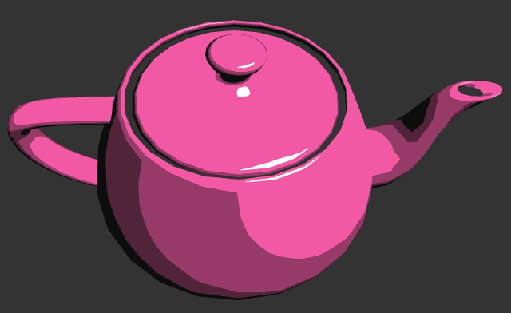

# Graphics Programming Resources

Articles, links, snippets, and useful resources for the Graphics Programming community.

So, in no particular order, we present the following:

## Tools
---

### Graphic Applications

- [Autodesk Maya](https://www.autodesk.ca/en/products/maya/overview)
- [Autodesk 3D Studio Max](https://www.autodesk.ca/en/products/3ds-max/overview)
- [Blender](https://www.blender.org/)
- [Lightwave 3D](https://www.lightwave3d.com/)
- [Modo](https://www.foundry.com/products/modo)

#### Learning

- [Beginners Guide To Learning 3D Graphics (Blender)](https://www.youtube.com/playlist?list=PLjEaoINr3zgHs8uzT3yqe4iHGfkCmMJ0P&disable_polymer=true)

### C++

- [C++ Builder](https://www.embarcadero.com/products/cbuilder)
- [CLion](https://www.jetbrains.com/clion/)
- [Eclipse](https://eclipse.org/) or [Cevelop](https://www.cevelop.com/)
- [KDevelop](https://www.kdevelop.org/)
- [Microsoft Visual Studio (Community)](https://www.visualstudio.com/vs/community/)
- [NetBeans](https://netbeans.org/)
- [SlickEdit](https://www.slickedit.com/)
- [XCode (OSX)](https://developer.apple.com/xcode/)

### General Purpose Text Editors

- [Atom](https://atom.io/)
- [Brackets](http://brackets.io/)
- [Coda](https://www.panic.com/coda/)
- [emacs](http://www.gnu.org/software/emacs/)
- [Light Table](http://lighttable.com/)
- [nano](https://www.nano-editor.org/)
- [Notepad++](https://notepad-plus-plus.org/)
- [Sublime Text](http://www.sublimetext.com/)
- [UltraEdit](https://www.ultraedit.com/)
- [Visual Studio Code](https://code.visualstudio.com/)
- [Vim](https://vim.sourceforge.io/)

## Books And Their Web Resources
---

- [Anton's OpenGL4 Tutorials](http://antongerdelan.net/opengl/#ebook)
- [Computer Graphics: Principles and Practice](http://dept.cs.williams.edu/~morgan/cgpp/)
- [Real-Time Rendering](http://www.realtimerendering.com/)

## Engines / SDKs
---

### Engines

- [Amazon Lumberyard](https://aws.amazon.com/lumberyard/)
- [Autodesk Stringray](https://www.autodesk.com/products/stingray/overview)
- [Banshee 3D](http://www.banshee3d.com/)
- [Fabric Engine](http://fabricengine.com/)
- [Falcor (NVidia)](https://github.com/nvidiagameworks/falcor)
- [Intrinsic](http://www.intrinsic-engine.com/)
- [Unreal Engine](https://www.unrealengine.com/en-US/what-is-unreal-engine-4)
- [Unity 3D](https://unity3d.com/)
- [Urho3D](https://github.com/urho3d/Urho3D)

### Rendering / General Purpose SDKs
- [BGFX Github source](https://github.com/bkaradzic/bgfx) as well as [documentation here](https://bkaradzic.github.io/bgfx/overview.html)
- [Cinder](https://libcinder.org/)
- [Epoxy (Successor to GLEW)](https://github.com/anholt/libepoxy)
- [G3D](http://casual-effects.com/g3d/) and the corresponding [Graphics Code](http://graphicscodex.com/projects/projects/)
- [GLFW](http://www.glfw.org/)
- [Magnum](https://github.com/mosra/magnum)
- [Ogre3D](http://www.ogre3d.org/)
- [OpenFrameworks](http://openframeworks.cc/)
- [SDL](https://www.libsdl.org/index.php)
- [SFML](https://www.sfml-dev.org/)

## APIs
---

### OpenGL

#### Libraries

- [Awesome OpenGL](https://github.com/eug/awesome-opengl)

#### Tutorials
- [Learn OpenGL](http://learnopengl.com/)
- [Learning Modern 3D Graphics Programming](https://paroj.github.io/gltut/index.html)
- [OpenGL Introduction](https://open.gl)
- [OpenGL + C# + OpenTK](http://dreamstatecoding.blogspot.ca/p/opengl4-with-opentk-tutorials.html)

### D3D

#### Learning
- [Introduction to D3D 11](https://www.3dgep.com/introduction-to-directx-11/)
- [Tightening Up The Graphics: Tools and Techniques](https://docs.google.com/presentation/d/1LQUMIld4SGoQVthnhT1scoA3k4Sg0as14G4NeSiSgFU/mobilepresent?slide=id.p)
- [Rastertek Tutorials](http://www.rastertek.com/tutdx11s2.html)

### Vulkan

#### Libraries

- [Awesome Vulkan](https://github.com/vinjn/awesome-vulkan)
- [Vulkano: Safe Rust Wrapper Around The Vulkan API](http://vulkano.rs/guide/introduction)

#### Tutorials

- [A Simple Vulkan Compute Example](http://www.duskborn.com/a-simple-vulkan-compute-example/)
- [API Without Secrets: Introduction To Vulkan](https://software.intel.com/en-us/articles/api-without-secrets-introduction-to-vulkan-part-1)
- [I Am Graphics And So Can You!](https://www.fasterthan.life/blog/2017/7/11/i-am-graphics-and-so-can-you-part-1)
- [Oculus VR SDK: Minimal Vulkan Sample](http://vulkano.rs/guide/introduction)
- [Vulkan Tutorial](https://vulkan-tutorial.com/Introduction)

### Metal

#### Tutorials

- [Metal By Example (blog)](http://metalbyexample.com/)
- [Metal By Example (book)](https://gumroad.com/l/metalbyexample/)
- [The Metal Framework](http://metalkit.org/)
- [Ray Wenderlich tutorials](https://www.raywenderlich.com/?s=metal)

## Programming
---

### Shaders

- [The Book Of Shaders](https://thebookofshaders.com/)

### C++

#### Libraries and Tools
- [Awesome C++](https://github.com/fffaraz/awesome-cpp)
- [C++ Shell](http://cpp.sh)
- [Compiler Explorer (not just C++)](https://gcc.godbolt.org)

#### Learning
- [Fred: C++ Notes](http://www.fredosaurus.com/notes-cpp/index.html)
- [Learn C++](http://www.learncpp.com)
- [Memory and C++ Debugging at EA](https://www.youtube.com/watch?v=8KIvWJUYbDA)
- [Programming in C++](https://github.com/Nuclearfossil/ProgrammingInCPP)

### C#

- [Introduction to C# Graphics](https://github.com/Nuclearfossil/IntroToCSharpGraphics)

## Siggraph Articles
---

### 2017

- [Advances in Real-Time Rendering in Games](http://advances.realtimerendering.com/s2017/index.html)

## WebGL

- [WebGL Insights: Free PDF version of the book](http://webglinsights.com)
- [Hackery, Math & Design](http://acko.net)

## Math

- [Immersive Math: Immersive Linear Algebra](http://immersivemath.com/ila/index.html)
- [Linear Interpolation - Past, Present and Future](https://fgiesen.wordpress.com/2012/08/15/linear-interpolation-past-present-and-future/)

## Various

- [Intel's Intrinsics Guide](https://software.intel.com/sites/landingpage/IntrinsicsGuide/)
- [x86-64 optimization papers](http://www.agner.org/optimize/#manuals)
- [UC Davis Introduction to Computer Graphics](https://youtu.be/01YSK5gIEYQ)

## Code Of Conduct

You can find the Code of Conduct [here](https://github.com/iFeli/GraphicsProgrammingCoC)
